# STaRNet: Spatio-Temporal and Riemannian Network for Motor Imagery EEG Decoding

<div align="center">


**A PyTorch implementation of STaRNet for high-performance motor imagery decoding from EEG signals**

</div>

## 📋 Overview

STaRNet is an innovative deep learning architecture that combines **multi-scale spatio-temporal CNNs** with **Riemannian geometry** for motor imagery classification. This implementation reproduces the model described in:

> **STaRNet: A spatio-temporal and Riemannian network for high-performance motor imagery decoding**  
> *Xingfu Wang, Wenjie Yang, Wenxia Qi, Yu Wang, Xiaojun Ma, Wei Wang*  
> Neural Networks 178 (2024) 106471

### 🔑 Key Features

- **Multi-scale Feature extraction**: Captures both global and local spatio-temporal patterns
- **Riemannian Manifold Learning**: Maps EEG covariance matrices to tangent space via matrix logarithm
- **End-to-end Training**: No preprocessing required (bandpass filtering, normalization, etc.)
- **High Performance**: Achieves state-of-the-art results on BCI Competition IV 2a dataset

### 🏗️ Architecture

```mermaid
graph LR
    A[EEG Input<br/>22×1750] --> B[Multi-scale<br/>Spatial Conv]
    B --> C[Multi-scale<br/>Temporal Conv]
    C --> D[Covariance<br/>Matrix]
    D --> E[Bilinear<br/>Mapping]
    E --> F[Matrix<br/>Logarithm]
    F --> G[Dense<br/>Layer]
    G --> H[4-class<br/>Output]
```

<div align="center">



</div>

## 📁 Project Structure

```
STaRNet/
├── 📄 main.py                 # Multi-subject training loop & performance summary
├── 🧠 starnet.py             # Complete STaRNet model architecture
├── 🔄 train.py               # Single-subject training & validation logic
├── 📊 data_loader.py         # BCI IV 2a dataset loader with windowing
├── 🌐 spatial_conv.py        # Multi-scale spatial convolution blocks
├── ⏱️ temporal_conv.py        # Multi-scale temporal convolution blocks
├── 📐 riemannian_layers.py   # Bilinear mapping, LogEig, and FC layers
├── 📋 requirements.txt       # Python dependencies
├── 📈 results/               # Training logs and performance metrics
│   ├── summary.txt          # Final performance comparison
│   ├── result_summary.json  # Detailed results in JSON format
│   └── log_sub{XX}.json     # Per-subject training logs
├── 📊 figs/                  # Validation accuracy curves
│   └── val_curve_sub{XX}.png
└── 📚 data/                  # Place BCI IV 2a dataset files here
    ├── A01T.mat             # Subject 1 training data
    ├── A01E.mat             # Subject 1 evaluation data
    └── ...                  # (Files not included - download separately)
```

## 🚀 Quick Start

### 1. Installation

```bash

# Create virtual environment
python -m venv venv
source venv/bin/activate  # On Windows: venv\Scripts\activate

# Install dependencies
pip install -r requirements.txt
```

### 2. Dataset Preparation

Download the **BCI Competition IV Dataset 2a** from:
- [Official Competition Website](https://bnci-horizon-2020.eu/database/data-sets)

Place the `.mat` files in the `./data/` directory:
```
data/
├── A01T.mat  # Subject 1 training
├── A01E.mat  # Subject 1 evaluation
├── A02T.mat  # Subject 2 training
├── A02E.mat  # Subject 2 evaluation
└── ...       # Continue for all 9 subjects
```

### 3. Training

```bash
# Train on all subjects (1-9) for 500 epochs
python main.py --subjects 1 2 3 4 5 6 7 8 9 --epochs 500 --batch 16 --data ./data/

# Train on specific subjects
python main.py --subjects 1 2 3 --epochs 300 --batch 32 --data ./data/

# Quick test run
python main.py --subjects 1 --epochs 50 --batch 8 --data ./data/
```

### 4. Command Line Arguments

| Argument | Type | Default | Description |
|----------|------|---------|-------------|
| `--subjects` | `int` | `[1,2,...,9]` | List of subject IDs to train |
| `--epochs` | `int` | `500` | Number of training epochs |
| `--batch` | `int` | `16` | Batch size for training |
| `--data` | `str` | `"./data/"` | Path to dataset directory |

## 📊 Performance Results

### Comparison with Paper Results

<div align="center">

| Subject | **Our Implementation** | **Original Paper** | **Difference** |
|:-------:|:----------------------:|:------------------:|:--------------:|
|         | **Acc** / **κ** | **Acc** / **κ** | **ΔAcc** / **Δκ** |
| **1** | 77.8% / 0.704 | 88.5% / 0.777 | -10.8% / -0.073 |
| **2** | 55.6% / 0.407 | 69.1% / 0.690 | -13.5% / -0.283 |
| **3** | 81.9% / 0.759 | 94.1% / 0.941 | -12.2% / -0.182 |
| **4** | 60.1% / 0.468 | 82.3% / 0.823 | -22.2% / -0.355 |
| **5** | 68.8% / 0.583 | 78.1% / 0.781 | -9.4% / -0.198 |
| **6** | 52.8% / 0.370 | 70.8% / 0.708 | -18.1% / -0.338 |
| **7** | 89.9% / 0.866 | 93.4% / 0.934 | -3.5% / -0.068 |
| **8** | 68.4% / 0.579 | 88.5% / 0.886 | -20.1% / -0.307 |
| **9** | 70.1% / 0.602 | 84.7% / 0.847 | -14.6% / -0.245 |
| **Average** | **69.5% / 0.593** | **83.3% / 0.777** | **-13.8% / -0.228** |

</div>

> **Note**: The performance gap may be due to differences in hyperparameters, data preprocessing, or implementation details not fully specified in the original paper.

## 🔧 Model Architecture Details

### Multi-Scale Spatial Feature Extraction
- **Branch 1**: 8×k filters with kernel size (8,1)
- **Branch 2**: 8×k filters with kernel size (16,1)  
- **Branch 3**: 16×k filters with kernel size (channels,1)
- **Fusion**: 1×1 convolution to combine multi-scale features

### Multi-Scale Temporal Feature Extraction
- **Branch 1**: 8 filters with kernel size (1,25) - ~100ms at 250Hz
- **Branch 2**: 8 filters with kernel size (1,50) - ~200ms at 250Hz
- **Branch 3**: 16 filters with kernel size (1,75) - ~300ms at 250Hz

### Riemannian Manifold Processing
1. **Covariance Matrix**: Compute spatial covariance from feature maps
2. **Bilinear Mapping**: Dimensionality reduction via `W @ Σ @ W.T`
3. **Matrix Logarithm**: Map to tangent space via eigendecomposition
4. **Classification**: Flatten + dropout + linear layer

## 🛠️ Implementation Notes

### Key Implementation Features
- **Automatic Mixed Precision**: Uses `torch.amp` for efficient training
- **Orthogonalization**: Periodic re-orthogonalization of bilinear mapping weights
- **Data Augmentation**: Sliding window approach for training (2s windows, 0.5s stride)
- **Regularization**: LayerNorm + Dropout for improved generalization

### Training Strategy
- **Optimizer**: Adam with learning rate 1e-3
- **Scheduler**: StepLR (decay by 0.5 every 150 epochs)
- **Loss Function**: CrossEntropyLoss
- **Validation**: Hold-out cross-validation (session-based split)

## 📈 Monitoring Training

### Real-time Progress
```
=== Subject 1 ===
Ep   1  val_acc 0.253  κ 0.004
Ep  10  val_acc 0.545  κ 0.393
Ep  20  val_acc 0.632  κ 0.509
...
Ep 500  val_acc 0.778  κ 0.704
```

### Generated Outputs
- **`figs/val_curve_sub{XX}.png`**: Validation accuracy curves
- **`results/summary.txt`**: Final performance table
- **`results/result_summary.json`**: Detailed metrics in JSON format

## 🔍 Troubleshooting

### Common Issues

**1. Dataset Not Found**
```
FileNotFoundError: [Errno 2] No such file or directory: './data/A01T.mat'
```
**Solution**: Download BCI IV 2a dataset and place `.mat` files in `./data/` directory.

**2. CUDA Out of Memory**
```
RuntimeError: CUDA out of memory
```
**Solution**: Reduce batch size: `--batch 8` or `--batch 4`

**3. Low Performance**
- Ensure dataset is correctly formatted
- Try different random seeds
- Adjust learning rate or training duration
- Check for proper GPU utilization

### Performance Optimization
- **GPU**: CUDA-enabled GPU strongly recommended
- **Memory**: 8GB+ GPU memory for batch size 16
- **CPU**: Multi-core CPU for data loading

## 📚 Citation

If you use this code in your research, please cite both the original paper and this implementation:

```bibtex
@article{wang2024starnet,
  title={STaRNet: A spatio-temporal and Riemannian network for high-performance motor imagery decoding},
  author={Wang, Xingfu and Yang, Wenjie and Qi, Wenxia and Wang, Yu and Ma, Xiaojun and Wang, Wei},
  journal={Neural Networks},
  volume={178},
  pages={106471},
  year={2024},
  publisher={Elsevier}
}
```
